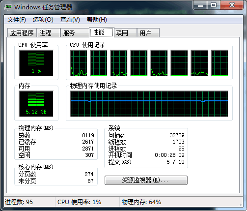
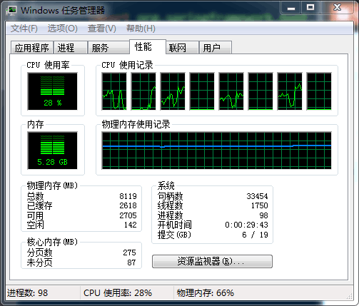
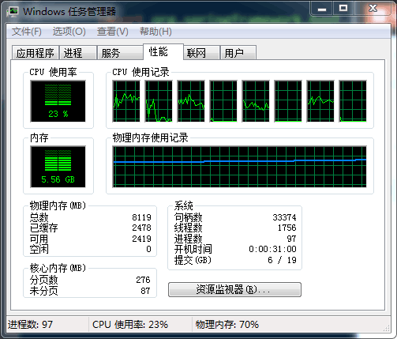
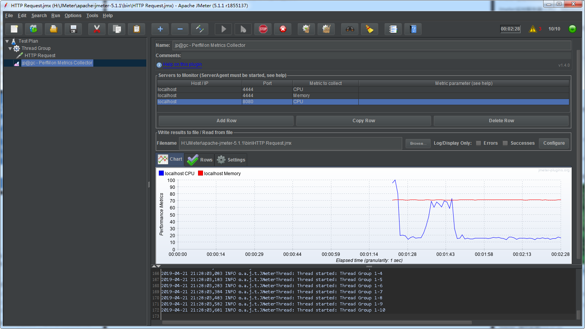
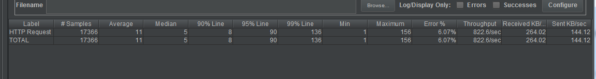
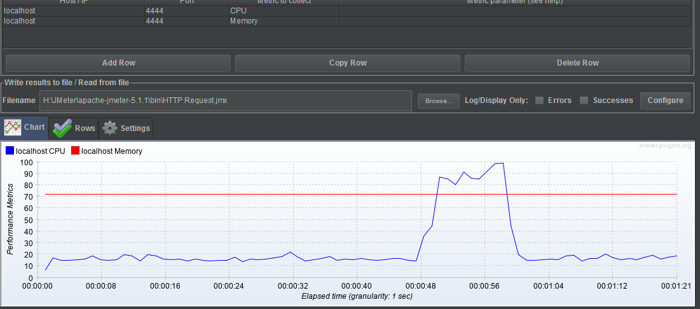
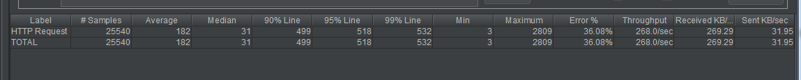

### Resource Consumption Of REST Service

#### Use Postman

* no requests

* 50 requests

* 500 requests

* 5000 requests

We can see that as the amount of requests increase, the consumption of memory grows a lot, and the CPU usage rate has a great gap between no request and having requests, but not so obvious between more requests and less request.

#### Use Jmeter

* 10 threads

  * cpu and memory

  

  * network

  

* 50 threads

  * cpu and memory

  

  * network

  

The more thread we use, we get higher error rate and longer request time. 