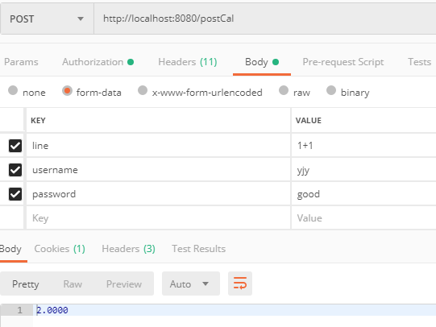
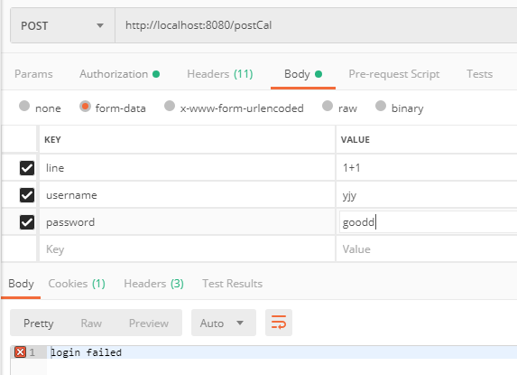

### 演示

现在，你可以访问http://47.103.0.246:1315来测试啦！

示例：（如果你也想试试的话，需要把localhost换成47.103.0.246）

传参时需要带上username和password

正例：

反例：

### dockerize

你也可以通过docker pull来下载我的[login](https://hub.docker.com/r/ketianya/login)和[calculate](https://hub.docker.com/r/ketianya/calculate)

